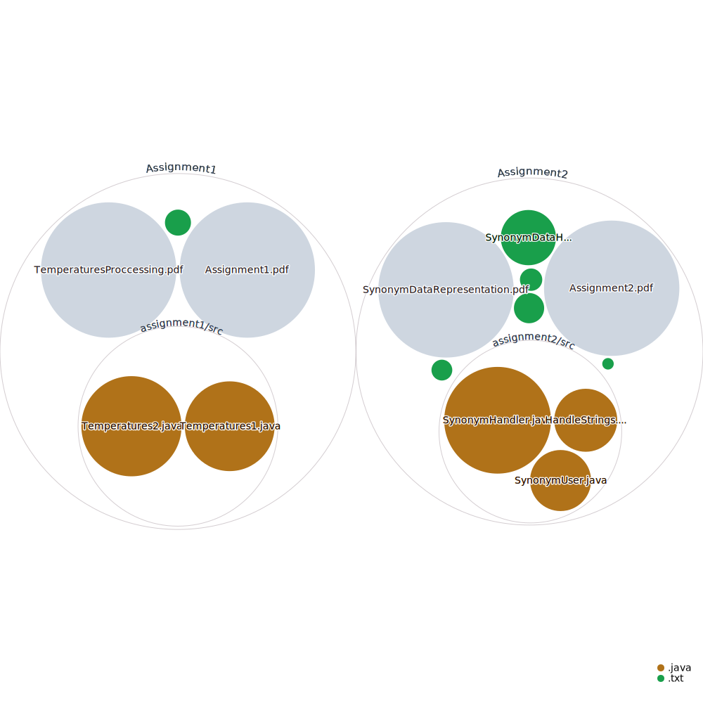

# Programming 1 - Object-Oriented Programming in Java

Welcome to the repository for the completed programming assignments for the "Programming 1" course in Object-Oriented Programming (OOP) at the Royal Institute of Technology (KTH) for the period two of the fall of 2023. In this course, we explore fundamental OOP concepts and practice Java programming.

## Code overview

## Assignment 1: Temperatures

**Description:**

Assignment 1, named "Temperatures," delves into Java programming for making temperature calculations. This assignment is designed to strengthen your Java skills and your understanding of basic mathematical operations in Java.

**Status:**
Completed

## Assignment 2: Synonyms

**Description:**

Assignment 2, named "Synonyms," focuses on string handling in Java. This assignment is an opportunity to enhance your Java programming capabilities and practice advanced string manipulation.

**Status:** 
Work in Progress

## Assignment 3: (Coming Soon)

**Description:**

Assignment 3 has not yet been added to this repository.

**Status:**
Work in Progress

## Contributing

We encourage students to contribute to this repository and make it a valuable resource for everyone. You can help in the following ways:

- Report issues: If you encounter any bugs, issues, or have suggestions for improvements, please [submit an issue](https://github.com/LukeyBit/KTH-Programming-1/issues).

- Contribute code: If you have enhancements or fixes for existing assignments, or if you'd like to contribute a new assignment, please follow the guidelines in our [Contribution Guide](CONTRIBUTING.md).

## Code of Conduct

Please follow our [Code of Conduct](CODE_OF_CONDUCT.md) to ensure a respectful and inclusive community.

## Getting Started

If you are a student looking to use these assignments as a guide, follow these steps:

1. Clone this repository to your local machine using the following command:

    `git clone https://github.com/LukeyBit/KTH-Programming-1.git`

2. Browse the respective assignment directories (e.g., `Assignment1` and `Assignment2`). To find the Java source code and associated files for each assignment. The source code is located in the src directory.

## Prerequisites

To successfully run these assignments, make sure you have:

- Java Development Kit (JDK) installed on your computer.

## License

This project is licensed under the MIT License - see the [LICENSE](LICENSE.md) file for details.

## Acknowledgments

These assignments were created as part of the "Programming 1" course at KTH for the period two of the fall of 2023. We would like to express our appreciation to the course instructors for their valuable guidance and support.

Please observe your institution's academic integrity policies when using these assignments as part of your coursework.

If you have any questions or need assistance, don't hesitate to contact us. Best of luck with your OOP journey in Java!
